# Full Project Audit

Date: 2026-07-21

Workspace: `/Users/chinmay_shringi/Desktop/sar`
Scope: official interview brief, discovery transcript, source code, Git state, saved traces, evaluator outputs, experiments, feedback-loop artifacts, security posture, production-readiness documentation, and presentation readiness.

## Executive verdict

The project contains work that can exceed the interview bar, especially the flight-direction root-cause story, trace-level attribution, deterministic-first evaluator design, evaluator adjudication history, and the finding that a stronger model can obey a bad prompt more consistently.

The current deliverable does not yet meet the interview bar as a complete package. The required repository link does not contain the engagement work, a local archive contains configured credentials, the saved feedback-loop runs stop before experimentation, the implemented loop does not test the failures it just curated, the PII experiment path bypasses redaction, the claimed metric gate does not exist, and there is no rendered customer-facing deck.

The central issue is not a lack of breadth. It is that the evidence chain is not closed:

```text
production failure -> trustworthy trace -> valid evaluation -> approved example
-> bounded candidate -> reproducible experiment -> real decision gate
-> controlled rollout -> business outcome
```

Several individual components exist, but the repository does not yet prove that full chain.

Recommendation: do not add more features before the interview. Repair the proof chain, correct unsupported claims, package a clean repository, and build the actual deck. Preserve the intentionally narrow two-fix story.

## Delivery status

| Area | Verdict | Evidence-backed assessment |
|---|---|---|
| Customer discovery fidelity | Needs correction | Most requirements are captured, but the human-gate request is misrepresented and the booking-conversion goal is not instrumented. |
| Observability and attribution | Strong prototype | OpenInference and OpenTelemetry traces support root-cause analysis. Trace loss and incomplete-run handling are not production-safe. |
| Deterministic evaluation | Strong foundation | Candidate B has convincing causal evidence. E1 is materially narrower than the project calls “groundedness.” |
| LLM judges | Provisional | No human labels exist, some judge context is incomplete, and same-model or behavior-circular grading remains possible. |
| Automated improvement loop | Not proven | Saved runs skip experiments, curated failures are not passed to experiments, and the gate does not compute eligibility. |
| Reproducibility | Not acceptable yet | The baseline records a dirty tree at the original upstream SHA. That SHA cannot recreate the measured code. |
| Privacy and security | Unsafe to distribute or deploy | A local archive contains configured credentials, experiment traffic bypasses redaction, and PII coverage is narrow. The prototype API also lacks production controls. |
| Business measurement | Missing | There are no booking, abandonment, handoff, feedback, or conversion events joined to trace and experiment versions. |
| Codebase link | Missing | All engagement work, including the evidence now under the Git root, remains local and uncommitted. The configured remote is the original Arize sample repository. |
| Customer-facing presentation | Missing | Only a Markdown outline exists. No PPTX, PDF, HTML deck, screenshots, charts, or tested fallback artifact exists. |
| Production-readiness discussion | Good document, prototype implementation | The discussion covers the brief well, but several claims in the deck exceed what the code proves. |

## Method and evidence standard

This audit used the following evidence:

- The six-page official brief at [US_FDE_Interview_Screen.pdf](/Users/chinmay_shringi/Desktop/sar/US_FDE_Interview_Screen.pdf).
- The supplied discovery transcript at [pasted-text.txt](/Users/chinmay_shringi/.codex/attachments/6b9e0242-9393-45bc-973b-83f3e5e157d1/pasted-text.txt).
- The Git repository at [sample-travel-agent](/Users/chinmay_shringi/Desktop/sar/sample-travel-agent).
- All artifacts under [docs](/Users/chinmay_shringi/Desktop/sar/sample-travel-agent/docs).
- Read-only static checks of all Python and data files.
- Current primary-source guidance from Arize, Anthropic, OpenTelemetry, NIST, OWASP, and Google SRE.

“Verified” in this report means directly observed in code, Git state, a saved artifact, the transcript, or the official brief. Recommendations and architecture proposals are labeled as such. No external model calls were made, no live customer traffic was generated, and no project implementation was changed during the audit.

Workspace note: during report review at approximately 19:59 local time, the existing evidence tree was moved from `/Users/chinmay_shringi/Desktop/sar/docs` into the repository at `/Users/chinmay_shringi/Desktop/sar/sample-travel-agent/docs`. This report reflects that post-move state. The moved evidence is still untracked, so it remains absent from a clean checkout and the configured remote.

## Anti-pattern and presentation verdict

There is no conventional frontend to evaluate. The only customer-facing presentation asset is [PRESENTATION.md](/Users/chinmay_shringi/Desktop/sar/sample-travel-agent/docs/PRESENTATION.md:1), a text outline of more than 15 slide sections. Because no rendered deck exists, visual hierarchy, accessibility, contrast, responsive behavior, speaker pacing, and projector legibility cannot be audited.

This is itself a critical deliverable finding. The official brief requests a customer-facing presentation, not only presentation notes.

The outline also contains customer-trust defects:

- The first slide contains `in your/ words` at [PRESENTATION.md](/Users/chinmay_shringi/Desktop/sar/sample-travel-agent/docs/PRESENTATION.md:7).
- The PM is called “An” at [PRESENTATION.md](/Users/chinmay_shringi/Desktop/sar/sample-travel-agent/docs/PRESENTATION.md:14), while the transcript introduction says “Anne.”
- The primary result appears late in the narrative at [PRESENTATION.md](/Users/chinmay_shringi/Desktop/sar/sample-travel-agent/docs/PRESENTATION.md:93).
- The deck says both fixes were proposed by the loop at [PRESENTATION.md](/Users/chinmay_shringi/Desktop/sar/sample-travel-agent/docs/PRESENTATION.md:85), but the saved loop proposed only Candidate B.
- The deck says the human-gate recommendation was put in writing before the presentation at [PRESENTATION.md](/Users/chinmay_shringi/Desktop/sar/sample-travel-agent/docs/PRESENTATION.md:130), while [FOLLOWUP_QUESTIONS.md](/Users/chinmay_shringi/Desktop/sar/sample-travel-agent/docs/FOLLOWUP_QUESTIONS.md:17) says that draft was never sent.
- The deck says “PII never leaves your process” at [PRESENTATION.md](/Users/chinmay_shringi/Desktop/sar/sample-travel-agent/docs/PRESENTATION.md:139), which is contradicted by stored experiment traces.

## Transcript truth matrix

| Discovered need | Current project response | Audit verdict |
|---|---|---|
| Increase booking conversion by at least 50% over the next year | Groundedness and quality metrics are treated as proxies | Honest as a proxy in the requirement map, but the system captures no conversion or funnel outcome. |
| Anchor planning -> itinerary -> booking | Planning and itinerary flows exist | Booking completion is not represented as a stateful outcome. The anchor workflow is therefore incomplete. |
| Do not fabricate hotels, flights, or prices | E1 inventory and price check | Useful but narrow. It does not validate all material claims, dates, availability, amenities, route prose, or weather. |
| Fix incorrect tool usage first | Candidate B fixes flight direction | This is the strongest measured story in the project. |
| Ask clarifying questions when needed, but not too many | E8 judge | Candidate A+B scores 30/33, or 91%, with no same-dataset control judge run and no human calibration. |
| Automate the PM team’s tone spot-checking | E11 tone judge | Implemented as provisional stretch work, but current deck and backlog still describe it as future work. |
| Compare models and track tokens/cost | Six-cell model matrix and token traces | Good concept and useful finding. Current pricing and automated cost logic are wrong for Sonnet and Opus. |
| Block PII before it reaches the model and eval system | Entry-point redaction and E6 detector | The API and CLI redact a narrow set, but the experiment harness bypasses that boundary and saved traces contain the test card. |
| Reusable, plug-and-play evaluation system | Normalized trace model and shared runner | The trace seam is reusable. Evaluators, failure mappings, candidate logic, and fixtures are travel-specific and hard-coded. |
| Automatically add failures to the dataset | Curate stage appends failed cases | The loop discards the curated dataset path before proposal and experiment. Direct-to-golden insertion also needs quarantine and review semantics. |
| Suggest low-complexity prompt or tool changes | Env-gated candidates | Strong. Candidates A and B are small and reversible. |
| Compare to baseline, roughly 85% to 90% | Experiment comparison docs | The gate implementation never parses these thresholds or regression rules. |
| Identify the first mistake in a chain | Span-level tool attribution | Strong and demonstrated by the backward-flight trace. |
| Nick did not want humans manually appending every failure | Project calls this “no human gate” and “auto production” | Incorrect. The transcript requested automatic dataset append, not unrestricted production promotion. |
| Working demo, customer presentation, codebase link | Local code, Markdown outline, local artifacts | The final package is incomplete. |

## Critical findings

### C1. A distributable archive contains configured credentials and private material

Verified evidence:

- [Archive.UNSAFE-CONTAINS-LIVE-KEY-DO-NOT-SEND.zip](/Users/chinmay_shringi/Desktop/sar/Archive.UNSAFE-CONTAINS-LIVE-KEY-DO-NOT-SEND.zip) contains 12,392 files and approximately 299 MB uncompressed.
- Its `sample-travel-agent/.env` is byte-identical to the current local `.env` and contains three configured values. Credential validity was not tested and no value was displayed during this audit.
- The archive also contains `.git/`, `.venv/`, `CLAUDE.md`, `BUILD_PLAN.md`, `REPO_FINDINGS.md`, `deep-research-report.md`, and the Interview 1 discovery playbook.

Impact: sending this archive can expose provider credentials, repository history, a large dependency tree, internal strategy, and interview preparation that is not part of the customer deliverable. Renaming the file warns a careful user but does not neutralize its contents.

Required action before the interview:

1. Do not send the current archive.
2. If it has ever left this machine, rotate all included credentials immediately. If distribution status is uncertain, rotation is the safer choice.
3. If a ZIP is required, build it from a clean tracked export after rotation and verify an allowlist of intended files.
4. Prefer the requested Git codebase link over an additional archive.
5. Verify the final artifact with native, ignore-independent secret scanning and a ZIP content inventory.

### C2. The required codebase deliverable does not contain the project

Verified evidence:

- The Git root is `/Users/chinmay_shringi/Desktop/sar/sample-travel-agent`.
- `HEAD` and the cached local `origin/main` ref point to the single original commit `0080b11`. The configured remote is the upstream Arize sample repository, not a candidate-owned deliverable.
- All engagement code is modified or untracked locally.
- Baselines, experiment receipts, the presentation, requirement map, and production documents are now inside the Git root under `docs/`, but the directory is untracked.
- The scheduled workflow references `docs/baseline/...` at [feedback-loop.yml](/Users/chinmay_shringi/Desktop/sar/sample-travel-agent/.github/workflows/feedback-loop.yml:27). That path exists locally but is absent after a clean checkout because the evidence has not been committed.

Impact: the final codebase link currently delivers the original sample, not the system being presented. A panelist cannot clone, inspect, reproduce, or run the claimed engagement work.

Required action before the interview:

1. Create a clean, reviewable commit history for the engagement code and intended docs without altering immutable raw evidence.
2. Verify all workflow paths and data artifacts from a clean clone.
3. Publish a candidate-owned repository and verify the link from a fresh clone. If it is meant to be public, also verify unauthenticated access.

### C3. The automated improvement loop is not end to end

Verified evidence:

- Both saved loop reports skip EXPERIMENT at [selftest loop_report.md](/Users/chinmay_shringi/Desktop/sar/sample-travel-agent/docs/loop-runs/selftest-2026-07-19/loop_report.md:36) and [LLM loop_report.md](/Users/chinmay_shringi/Desktop/sar/sample-travel-agent/docs/loop-runs/llm-propose-2026-07-19/loop_report.md:43).
- `curate()` returns a versioned dataset path, but the return is discarded at [feedback_loop.py](/Users/chinmay_shringi/Desktop/sar/sample-travel-agent/scripts/feedback_loop.py:777).
- Proposal and experiment receive the original dataset at [feedback_loop.py](/Users/chinmay_shringi/Desktop/sar/sample-travel-agent/scripts/feedback_loop.py:778) and [feedback_loop.py](/Users/chinmay_shringi/Desktop/sar/sample-travel-agent/scripts/feedback_loop.py:785).
- The gate only links a comparison and always prints `PROMOTION: BLOCKED` at [feedback_loop.py](/Users/chinmay_shringi/Desktop/sar/sample-travel-agent/scripts/feedback_loop.py:710). It does not evaluate E1, 85% or 90%, hard invariants, regressions, integrity, or telemetry.

Impact: the system demonstrates useful components, but not the central brief requirement. Newly captured failures do not influence the candidate experiment, and the gate is a human stop sign rather than a decision policy.

Required action before the interview:

1. Pass the curated dataset artifact into proposal and experiment.
2. Add an integrity gate before quality scoring.
3. Compute eligibility from a versioned policy with hard invariants, quality floors, regression limits, and operational limits.
4. Preserve human approval as the final production control.
5. Save one complete collect -> evaluate -> cluster -> curate -> propose -> experiment -> gate receipt.

### C4. The PII boundary is bypassed in the experiment path

Verified evidence:

- The experiment harness appends the raw user message at [run_experiment.py](/Users/chinmay_shringi/Desktop/sar/sample-travel-agent/scripts/run_experiment.py:126) and calls `run_agent()` directly at [run_experiment.py](/Users/chinmay_shringi/Desktop/sar/sample-travel-agent/scripts/run_experiment.py:133).
- Redaction is applied at API and CLI entry points, not inside the shared agent boundary.
- The raw synthetic card probe appears in stored LLM request traces, including [candidate A+B spans](/Users/chinmay_shringi/Desktop/sar/sample-travel-agent/docs/experiments/candidate-AB-combined/spans.jsonl:97) and [candidate C spans](/Users/chinmay_shringi/Desktop/sar/sample-travel-agent/docs/experiments/candidate-C-concise/spans.jsonl:101).
- The judge calibration export also contains the raw probe at [calibration_sheet.csv](/Users/chinmay_shringi/Desktop/sar/sample-travel-agent/docs/evals/judges-candidate-AB/calibration_sheet.csv:86).
- E6 detects the leak after the fact. Detection is not source prevention.

Impact: the project’s strongest privacy claim is false for experiment traffic. The probe is synthetic, but it proves that real PII would cross the model and evaluation boundary through the same path.

Required action before the interview:

1. Put policy enforcement and redaction inside one shared boundary used by API, CLI, replay, experiments, feedback curation, judge input, and exports.
2. Treat the current leaking artifacts as security test evidence, not PII-compliance evidence.
3. Sanitize any presentation or upload copy while retaining a controlled local incident record if needed for audit history.
4. Add an end-to-end test that inspects provider-bound messages, trace attributes, eval rows, and exported artifacts for the planted secret.
5. Change the claim to the exact measured scope until wider entity coverage exists.

### C5. Baseline and experiment provenance cannot reproduce the measured system

Verified evidence:

- The frozen baseline manifest records SHA `0080b11` and `git_dirty: true` at [manifest.json](/Users/chinmay_shringi/Desktop/sar/sample-travel-agent/docs/baseline/2026-07-19/manifest.json:3).
- That SHA is the unchanged upstream sample, while the evaluated implementation is in uncommitted and untracked files.
- Experiment manifests do not preserve the dirty diff or source-tree hash, dataset-content hash, prompt hash, lockfile hash, evaluator version, retry policy, or complete execution configuration.
- Baseline capture inherits ambient flags and model configuration at [capture_baseline.py](/Users/chinmay_shringi/Desktop/sar/sample-travel-agent/scripts/capture_baseline.py:41) rather than enforcing the shipped control.

Impact: the traces remain useful historical receipts, but the stated control cannot be reconstructed. Percentage claims cannot be independently reproduced from the recorded commit.

Required action before the interview:

1. Do not overwrite the existing baseline.
2. Label it accurately as a frozen but source-unreproducible historical capture.
3. Commit the code, then record source hash, Git state, dependency lock hash, dataset hash, evaluator hash, prompt text/hash, model ID, sampling settings, feature flags, and time basis for every new run.
4. Make control capture fail closed if the tree or control configuration does not match the declared baseline policy.

### C6. Customer statements are misrepresented

Verified evidence:

- [REQUIREMENT_MAP.md](/Users/chinmay_shringi/Desktop/sar/sample-travel-agent/docs/REQUIREMENT_MAP.md:22) says Nick requested no human gate and automatic production.
- The transcript says failed interactions should be appended to the evaluation dataset automatically without a person manually reviewing each append. It does not ask for automatic production promotion.
- [PRESENTATION.md](/Users/chinmay_shringi/Desktop/sar/sample-travel-agent/docs/PRESENTATION.md:130) says the human-gate recommendation was put in writing before the presentation.
- [FOLLOWUP_QUESTIONS.md](/Users/chinmay_shringi/Desktop/sar/sample-travel-agent/docs/FOLLOWUP_QUESTIONS.md:17) says that draft was never sent.

Impact: this can damage customer trust more than a missing feature. A good safety recommendation is being presented as both a customer disagreement and a prior communication when neither is supported.

Required action before the interview:

- State: “Nick requested automatic failure capture into the evaluation pipeline. I recommend automatic quarantine and evaluation, with human approval before production promotion.”
- Do not call this a deviation from Nick unless a later customer message explicitly rejects the promotion gate.
- Remove the claim that the recommendation was previously sent unless there is external evidence not present in this workspace.

### C7. The final customer-facing deck does not exist

Verified evidence: the workspace contains [PRESENTATION.md](/Users/chinmay_shringi/Desktop/sar/sample-travel-agent/docs/PRESENTATION.md:1), but no PPTX, PDF, HTML customer deck, rendered customer-deck architecture diagram, chart, trace screenshot, or sanitized presentation-ready offline demo backup. Raw JSONL, run logs, and replay tooling do exist.

Impact: one of three explicit final deliverables is missing. The panel cannot assess communication quality from an unrendered outline, and a live AX failure would leave no credible visual fallback.

Required action before the interview:

- Produce and inspect a real deck.
- Put the business outcome, the backward-flight trace, the measured A/B result, and the loop architecture in the first half.
- Include sanitized local receipts and AX screenshots as fallback evidence.
- Rehearse a timed narrative with a no-network demo path.

## High-severity findings

### H1. “100% groundedness” is not supported by E1

E1 checks named hotel entities, flight numbers, and attached prices at [e_grounding.py](/Users/chinmay_shringi/Desktop/sar/sample-travel-agent/evals/e_grounding.py:151). It does not validate dates, schedules, availability, amenities, ratings, route prose, weather claims, or arbitrary factual assertions. A baseline response that invented “direct flight” still passed E1.

Recommendation: rename E1 to “known inventory entity and price grounding.” Add claim-level extraction and field-level source attribution before using “groundedness” without qualification.

### H2. The documented promotion policy does not resolve the known E4 failure

The anchor workflow includes itinerary generation, but E4 remains 0% across the main variants because `create_itinerary` is off by one. The advertised policy focuses on E1 and telemetry and gives no explicit waiver or acceptance rule for a known baseline defect in the anchor workflow. The implemented gate always blocks, so no actual unsafe promotion occurred.

Recommendation: separate hard safety invariants from capability scores, then declare every required workflow evaluator, inherited baseline exception, and allowable regression before running an experiment. A pre-existing defect does not necessarily have to block an unrelated bounded improvement, but the decision must be explicit.

### H3. The “golden dataset” is an unlabeled development regression prompt suite

The dataset schema contains prompts, tags, sources, and targets, but no accepted expected output or customer label. The same cases were used for defect discovery, evaluator tuning, candidate design, and success reporting. There is no sealed holdout or out-of-distribution suite.

Recommendation: rename the current artifact to “development regression suite.” Establish raw-failure quarantine, labeled development, frozen regression, sealed holdout, and production-shadow cohorts.

### H4. LLM judges are not calibrated for promotion

All calibration sheets attached to real experiment runs have empty human-label columns. The populated [agreement_demo.csv](/Users/chinmay_shringi/Desktop/sar/sample-travel-agent/evals/calibration/agreement_demo.csv:2) is synthetic demonstration data, not customer calibration. E8 sees current input, reply, and tool names but not full prior conversation context. Identical follow-up text receives inconsistent “clarification needed” reasoning between candidates, suggesting the judge infers need from the assistant behavior it is grading. The Python code only recomputes a conjunction of model-produced booleans; it does not make the judgment deterministic.

Recommendation: collect a balanced customer-labeled calibration set, report per-evaluator precision, recall, agreement, and disagreement categories, preserve prompt/model provenance, and keep judge scores out of automatic promotion until calibrated.

### H5. The before/after story omits a relevant provisional metric

The deck introduces unnecessary clarification as a customer concern, but the headline table reports only E1, E2, latency, and cost. Candidate A+B scored 30/33, or 91%, on E8. With no same-dataset control judge run, this is not a verified regression, but it is still a customer-relevant provisional result that should not be silently omitted.

Recommendation: show a complete predeclared scorecard. If a metric is provisional or incomparable, say so rather than omitting it.

### H6. One trial per condition cannot establish expected latency or cost improvement

Each model/candidate cell appears to have one stochastic run. Main runs overlapped, which can contaminate latency. There is no paired repetition, randomized order, bootstrap interval, or predeclared uncertainty rule.

Recommendation: run repeated paired trials, randomize or block execution order, report distribution and uncertainty, and reserve causal language for effects that clear the declared rule. Dollar amounts and latencies are exact observations for their stored runs, but not established repeatable effects.

### H7. The project does not measure the business outcome

Discovery tied success to at least 50% growth in booking conversion. No schema records option selection, booking initiated, booking completed, abandonment, escalation, correction, CSAT, or explicit feedback. There is no join from business outcome to `session_id`, `trace_id`, `prompt_version`, `agent_version`, and experiment cohort.

Recommendation: add leading quality signals and lagging business outcomes. Optimize cost per successful booking and conversion lift, not only cost per turn.

### H8. Failure curation lacks an explicit quarantine contract

The loop writes failures into a run-local `dataset.curated.json`; it does not mutate or automatically promote the committed source dataset. However, the curated copy lacks explicit quarantine status, review metadata, label confidence, and a promotion contract. It can ingest evaluator defects, attacks, sensitive text, incomplete multi-turn context, ambiguous cases, and transient infrastructure failures.

Recommendation: call this artifact a failure quarantine, not a golden dataset. Deduplicate, redact, classify, reproduce, and assign confidence automatically. Promote to regression or holdout suites only through explicit policy and, for subjective cases, human labeling.

### H9. “Plug and play” is overstated

The normalized trace model is a credible portability seam. The rest is domain-bound: evaluators import travel fixtures, failure codes map directly to `search_flights`, and candidate definitions are hard-coded in [feedback_loop.py](/Users/chinmay_shringi/Desktop/sar/sample-travel-agent/scripts/feedback_loop.py).

Recommendation: describe the current system as “portable tracing substrate with travel-specific eval and remediation plugins.” A real plug-in contract would define adapter interfaces for trace normalization, evaluator applicability, dataset schemas, candidate types, and promotion policies.

### H10. Trace and evaluation integrity fail open

[trace_model.py](/Users/chinmay_shringi/Desktop/sar/sample-travel-agent/evals/trace_model.py:112) silently skips trace groups without a root. Evaluator exceptions become ordinary failed business rows, and the runner exits successfully. Missing latency or iteration fields cannot breach E7.

Recommendation: run a separate integrity gate before any quality metric. Assert expected case count, root/reply cardinality, terminal status, evaluator health, required attributes, and export success. Infrastructure failure must be distinct from agent-quality failure.

### H11. There is no conventional test or CI quality gate

All Python files parse, but there are no unit tests, integration tests, adversarial evaluator tests, API tests, coverage configuration, type checks, lint checks, dependency audit, or security scan. The only workflow runs the broken feedback loop.

Recommendation: add targeted tests around the two approved fixes, eval applicability and denominators, trace integrity, PII boundary, dataset curation plumbing, metric gate, and clean-clone workflow. Do not broaden into fixing every known agent bug.

### H12. Automated cost accounting is model-incorrect

[compare_experiments.py](/Users/chinmay_shringi/Desktop/sar/sample-travel-agent/scripts/compare_experiments.py:32) and E7 apply Haiku $1/$5 rates to every run, and normalized traces discard model identity and prompt-cache counters. Separately, [MODEL_COMPARISON.md](/Users/chinmay_shringi/Desktop/sar/sample-travel-agent/docs/MODEL_COMPARISON.md:8) uses $3/$15 for Sonnet and obsolete $15/$75 Opus rates.

As of 2026-07-21, official Anthropic standard rates are Haiku 4.5 at $1/$5 per million input/output tokens, Sonnet 5 at an introductory $2/$10 through 2026-08-31, and Opus 4.8 at $5/$25, according to [Anthropic’s current pricing](https://platform.claude.com/docs/en/about-claude/pricing).

Recommendation: version pricing by provider, model ID, effective date, region, cache class, and batch class. Store model identity and all billing-token categories in the normalized trace.

### H13. Local secrets and artifacts have weak access controls

The local `.env` contains configured Anthropic and Arize credentials and is mode `0644`. Values were not displayed during this audit. Many experiment and eval artifacts are also `0644` and contain complete conversations.

Recommendation: make secrets owner-readable only, use a managed secret store for deployment, separate sanitized interview receipts from restricted raw evidence, define retention/deletion, and rotate credentials if there is any uncertainty about exposure.

### H14. Packaged and clean-clone execution are broken

The wheel packages only `agent`, but `agent/tools.py` opens sibling `data/*.json` files at import. The upload scripts contain one developer’s absolute macOS path. The workflow depends on currently untracked docs that are not present in a clean checkout.

Recommendation: make fixtures package resources or explicit configuration, remove machine paths, and add a clean wheel-install and clean-clone smoke test.

## Medium findings

1. [agent/prompt.py](/Users/chinmay_shringi/Desktop/sar/sample-travel-agent/agent/prompt.py:13) freezes the current date at module import. Relative-date behavior can become stale in a long-lived service.
2. Prompt, model, and feature flags are read at import. “Rollback is a flag flip, not a redeploy” is inaccurate because a process restart or config rollout is required.
3. The health endpoint is liveness only. It does not test provider credentials, trace export, writable storage, or session readiness.
4. Tracing disables itself after setup failure and the API can continue to report healthy. For an eval-centered system, loss of telemetry is a degraded or unavailable control plane.
5. The local trace sink has no retention or disk-full strategy.
6. The session stores have no TTL, deletion, encryption, size limits, or data-subject workflow.
7. Tool inputs such as `num_days` are unbounded, and raw exception text can reach the model and traces.
8. Retry sleeps are blocking, have no jitter or deadline, and are not paired with circuit breaking.
9. Current monitor thresholds are based on one small 23-turn run. They are provisional heuristics, not calibrated SLOs.
10. An “any E1 miss pages” rule will be noisy at scale without minimum volume, evaluator health, multi-window logic, and false-positive calibration.
11. E2 compares different applicability denominators, 1/9 versus 8/8. Fixed-case cohorts and applicability rate should accompany pass rate.
12. E8 and E9 run on many irrelevant traces, which can dilute the small number of important probes.
13. E10’s advertised 2/2 includes one true supersession case and one no-supersession case. It does not establish detector recall.
14. `.env.example` omits Arize credentials and many runtime feature flags, so a new user cannot reproduce the configured system from documented variables.
15. GitHub Actions use mutable major action tags rather than immutable commit SHAs. There is no dependency update policy, SBOM, provenance attestation, or vulnerability scan.
16. Runtime serving and offline evaluation dependencies are installed together, expanding the production package and attack surface.
17. README and customer documents disagree about E10/E11, judge models, SQLite support, and what remains unbuilt.
18. AX upload/read-back claims lack a durable sanitized screenshot or exported receipt for an offline interview fallback.
19. The explicit “which Arize/Phoenix skill or CLI was used” requirement remains ambiguous in [SKILLS_LOG.md](/Users/chinmay_shringi/Desktop/sar/sample-travel-agent/docs/SKILLS_LOG.md:7). State the exact SDK, instrumentation, UI, CLI, or skill used without implying a tool that was not used.
20. The default service still contains known hotel, weather, itinerary, and flight-date defects. Leaving these as an explicit prioritized backlog is correct for this interview, but the service must not be described as production-ready.
21. The prototype API accepts unbounded messages and caller-supplied conversation IDs without authentication, authorization, ownership validation, or rate limits. The agent loop has no iteration, token, cost, or wall-clock budget. This is not required implementation hardening for the interview, but it is mandatory before public deployment.
22. Session get, mutation, model execution, and put are non-atomic. The in-memory store returns a shared mutable list, SQLite shares a connection without session-level concurrency control, and the local JSONL exporter lacks multi-process coordination. These belong in the production-readiness gap list.
23. [REMEDIATION_PLAN.md](/Users/chinmay_shringi/Desktop/sar/sample-travel-agent/docs/REMEDIATION_PLAN.md:1) was created immediately before the evidence move and still says `docs/` is a sibling of the Git root. Treat it as a point-in-time plan and refresh its status before using it as the execution source of truth.

## Positive findings to preserve

### 1. Candidate B has strong causal evidence

The flight-direction defect is the best story in the project. Control and prompt-only runs fail the same direction cases. The tool fix changes ordered-route matching, and the Candidate B variants pass the applicable recommendation cases. The result moves from 1/9 applicable reply-level flight-direction passes to 8/8. One previously applicable nonexistent-route case becomes an honest empty result covered by E5. This is traceable in [COMPARISON.md](/Users/chinmay_shringi/Desktop/sar/sample-travel-agent/docs/experiments/COMPARISON.md:7) to a concrete implementation defect rather than a vague prompt rewrite.

### 2. The trace-level attribution model is useful

OpenInference and OpenTelemetry semantics, tool spans, model spans, version attributes, and the normalized trace seam support first-error attribution. This is aligned with the customer request and portable to Phoenix or another OpenTelemetry backend.

### 3. Deterministic checks are correctly preferred where possible

Fixture-backed inventory permits exact checks. Using code before an LLM judge is cheaper, more reproducible, and easier to debug.

### 4. Evaluator adjudication is unusually honest

[EVAL_ADJUDICATION.md](/Users/chinmay_shringi/Desktop/sar/sample-travel-agent/docs/EVAL_ADJUDICATION.md:9) preserves false-positive discovery, correction, rescoring, and old results rather than hiding them. This is a compelling example of evaluating the evaluator.

### 5. The model-upgrade trap is differentiating

The stronger-model experiments show that model capability does not repair a contradictory system contract and may make the model follow the wrong instruction more effectively. Preserve this as a measured caution, while avoiding broad “best model” conclusions from one trial.

### 6. The change candidates are bounded

Prompt and tool fixes are small, env-gated, conceptually reversible, and match the customer’s low-complexity constraint.

### 7. The backlog demonstrates prioritization

Known defects remain visible rather than being quietly fixed. This supports the interview’s focus on judgment and system design.

### 8. The production document covers the requested discussion areas

[PRODUCTION_READINESS.md](/Users/chinmay_shringi/Desktop/sar/sample-travel-agent/docs/PRODUCTION_READINESS.md:1) addresses deployment, configuration, secrets, failures, observability, resources, scale, cost, reliability, and rollback. It should be presented as a target design, not as implemented production capability.

## Corrected model cost table

The following values are recalculated from the stored provider-reported prompt and completion token counts using [Anthropic’s official base rates](https://platform.claude.com/docs/en/about-claude/pricing) on 2026-07-21. They exclude cache modifiers, regional premiums, and batch discounts.

| Run | Prompt tokens | Completion tokens | Correct rate, input/output per MTok | Recalculated cost | Multiple of Haiku control |
|---|---:|---:|---:|---:|---:|
| Haiku 4.5 control | 66,882 | 8,587 | $1 / $5 | $0.109817 | 1.0x |
| Haiku 4.5 fixed configuration, prompt v1 + flight-tool fix | 71,196 | 6,807 | $1 / $5 | $0.105231 | 0.96x |
| Sonnet 5 shipped prompt | 84,018 | 23,847 | $2 / $10 through 2026-08-31 | $0.406506 | 3.7x |
| Opus 4.8 shipped prompt | 76,436 | 21,042 | $5 / $25 | $0.908230 | 8.3x |
| Sonnet 5 fixed configuration, prompt v1 + flight-tool fix | 79,140 | 11,462 | $2 / $10 through 2026-08-31 | $0.272900 | 2.5x |
| Opus 4.8 fixed configuration, prompt v1 + flight-tool fix | 73,787 | 10,868 | $5 / $25 | $0.640635 | 5.8x |

The previous table’s approximate 5.6x Sonnet and 25x Opus multipliers are not current. Sonnet 5 moves to $3/$15 on 2026-09-01 under the currently published pricing, so every report should record the effective pricing date.

## What current production teams add beyond this prototype

The following recommendations are grounded in current primary-source practice, not presented as features already implemented here.

### Evaluation architecture

Arize AX defines experiments as a combination of curated datasets, tasks, evaluators, independently stored runs, and side-by-side regression comparison. It also separates online evaluation on production traces from offline evaluation on experiments. The project has many of these pieces, but its automated loop must preserve the dataset and run lineage between them.

Anthropic’s agent-evaluation guidance distinguishes a trial, complete trajectory, and real environment outcome. It recommends multiple trials because outputs vary, and combining code, model, and human graders. It also distinguishes capability suites from regression suites, with regression tasks expected to remain near 100%.

For this travel system, an assistant saying “booked” is not success. Success is a booking record, or at minimum a verified booking-state transition in the environment. Trajectory checks, such as correct tools and parameters, should complement that outcome rather than replace it.

### Risk and governance

NIST’s AI RMF calls for documented test sets and metrics, measures of uncertainty, deployment-like evaluation, production monitoring, privacy and security evaluation, independent review, and user feedback integrated into evaluation. This maps directly to the project’s missing holdout, uncertainty, privacy boundary, business outcome, and human-calibration layers.

OWASP’s agentic threat guidance recommends explicit threat modeling for autonomous systems. A travel agent threat model should cover direct and indirect prompt injection, tool output poisoning, excessive agency, cross-session data access, resource exhaustion, sensitive-data exfiltration, and unsafe downstream actions.

### Release engineering

Google SRE’s canary model requires a way to expose a subset of traffic, an evaluation process that calls a candidate good or bad, and integration of that decision into release. Human approval is compatible with this model. Approval should authorize a candidate that already passed an automated policy, not substitute for the policy.

## Recommended target architecture

```mermaid
flowchart LR
    U["Traveler or channel"] --> G["Authenticated API gateway\nrate, size, tenant limits"]
    G --> P["Privacy and policy boundary\nredact, tokenize, classify"]
    P --> A["Versioned agent runtime\nstep, time, token, cost budgets"]
    A --> T["Validated least-privilege tools"]
    A --> C["OpenTelemetry Collector\nredaction, sampling, buffering"]
    T --> C
    C --> AX["Arize AX or Phoenix\nhot traces, online evals, alerts"]
    C --> D["Durable restricted event store"]
    B["Booking, abandonment, handoff, CSAT"] --> D
    D --> Q["Failure quarantine\ndedup, privacy, integrity, taxonomy"]
    Q --> DS["Versioned suites\ndev, regression, sealed holdout"]
    DS --> X["Paired multi-trial experiments"]
    X --> GT["Policy gate\ninvariants, quality, ops, uncertainty"]
    GT --> H["Human approval"]
    H --> K["Canary rollout"]
    K --> M["Outcome and risk monitoring"]
    M -->|"rollback or expand"| K
    M --> Q
```



### Online serving path

- Authenticate the caller and bind conversation ownership to a tenant and subject.
- Apply one privacy and policy boundary before any provider, trace, evaluator, replay, or persistence path.
- Enforce request size, max turns, wall time, tokens, spend, tool calls, and cancellation.
- Validate tool schemas and authorize actions by tool, resource, and workflow state.
- Emit versioned OpenTelemetry spans without unbounded sensitive content.
- Export through a collector or durable buffer, not synchronously to an unbounded local file.

### Evaluation and data path

- Join trace/session data with booking outcomes and explicit feedback.
- Separate evaluator health from agent quality.
- Send production failures to a privacy-screened quarantine, not directly to the golden suite.
- Preserve fixed development, frozen regression, sealed holdout, and production-shadow cohorts.
- Store dataset, evaluator, prompt, model, source, dependency, and pricing lineage.
- Use deterministic field and state checks for inventory and bookings.
- Use calibrated LLM judges for tone and conversational judgment, with periodic human disagreement review.

### Promotion policy

Use a layered decision, not one blended pass rate:

1. **Run integrity:** all expected cases, roots, replies, terminal statuses, required fields, and evaluators are present and healthy.
2. **Hard invariants:** zero detected known-inventory entity/price violations, no planted PII beyond the source boundary, correct authorization, and valid tool parameters. Expand the first invariant only when claim-level grounding is implemented.
3. **Regression suite:** previously solved cases remain near 100%, with an explicit per-eval no-regression rule.
4. **Capability target:** use 85% or 90% only for appropriate non-safety quality metrics.
5. **Uncertainty:** repeated paired trials clear a predeclared confidence or consistency rule.
6. **Operations:** latency, error, token, and cost budgets pass by model and cohort.
7. **Business guardrails:** no adverse change in booking initiation, completion, abandonment, or handoff when enough traffic exists.
8. **Human authorization:** an owner approves the signed candidate and evidence bundle.
9. **Canary:** small traffic exposure with automated rollback and control comparison.

### Dataset lifecycle

```text
raw production signal
  -> restricted failure quarantine
  -> integrity, privacy, and evaluator triage
  -> reproducible labeled case
  -> development/capability suite
  -> frozen regression suite after the behavior is solved
  -> sealed holdout maintained independently
```

This preserves Nick’s request for automatic failure collection without pretending every failed automated label is immediately golden truth.

## What the interviewer may not explicitly ask, but industry systems need

1. **Eval integrity as a service-level dependency.** If tracing or evaluators fail, the system must not report a deceptively favorable agent score.
2. **Outcome verification.** Tool trajectories matter, but a booking database state is stronger evidence than an assistant sentence.
3. **Selection-bias control.** Only evaluating flagged failures or easy applicable cases distorts quality estimates.
4. **Dataset contamination control.** Automated failure mining needs quarantine, provenance, label confidence, and promotion states.
5. **Judge risk management.** Same-model grading, missing conversation context, prompt leakage, and self-referential labels can all inflate scores.
6. **Causal experiment design.** Repetition, paired cases, randomized order, uncertainty, and a sealed holdout separate signal from sampling noise.
7. **Business joins.** The useful unit is cost and quality per successful traveler outcome, not only per trace.
8. **Silent-observability failure.** An eval-centered platform needs trace-loss rate, evaluator error rate, queue lag, and coverage monitors.
9. **Privacy across every execution path.** Offline replay, experiments, labeling, support exports, and judge prompts often bypass the serving boundary.
10. **Multi-tenant controls.** Session ownership, data residency, retention, deletion, and tenant budgets become fundamental at real scale.
11. **Canary and rollback semantics for prompts and tools.** Versioned configuration, traffic cohorts, approval receipts, and automated rollback are required even when no binary changes.
12. **Model and evaluator drift.** Provider model aliases, prices, tokenizers, judge prompts, and tool-use behavior change over time and must be pinned or recorded.

## Prioritized recovery plan

### P0, before the interview

1. **Neutralize the unsafe archive.** Do not send it. Determine whether it left the machine, rotate included credentials as required, and prefer the requested Git link.
2. **Package the real repository.** Commit the intended code, docs, sanitized receipts, and workflow to a candidate-owned repository, then verify a fresh clone.
3. **Build the actual deck.** Lead with the business outcome and flight-direction trace, include the loop and target architecture, and create a sanitized offline fallback.
4. **Correct the customer record and claims.** Fix the auto-append versus auto-production error, remove the unsent-email claim, resolve Anne’s name, qualify E1, disclose E8, and label single-run effects accurately.
5. **Close the loop.** Pass the curated dataset forward, implement the policy computation, and save one complete end-to-end run.
6. **Repair the privacy proof.** Route experiments through the shared source boundary, add a focused provider/trace/eval leak test, and replace the absolute PII claim with measured scope.
7. **Add narrow verification.** Cover curated-dataset plumbing, gate behavior, redaction across paths, trace completeness, Candidate B, and clean-clone execution.
8. **Correct pricing.** Make cost computation model-aware and update the model comparison using effective-date pricing.

Do not fix the remaining hotel, weather, itinerary, and date bugs before the interview. Keep them visible in the prioritized backlog unless new customer direction changes scope.

### P1, next engineering sprint

1. Add authentication, session ownership, request limits, execution budgets, cancellation, and readiness.
2. Add failure quarantine and dataset promotion states.
3. Create customer-labeled judge calibration and same-dataset control/candidate runs.
4. Add repeated paired experiments, uncertainty, holdout, and fixed applicability cohorts.
5. Instrument booking funnel, abandonment, handoff, corrections, CSAT, and cohort assignment.
6. Move traces through an OpenTelemetry Collector or durable buffer and monitor evidence loss.
7. Add CI for unit, integration, security, packaging, reproducibility, and workflow smoke tests.
8. Create a signed evidence bundle per candidate with hashes, policy result, approver, and rollback target.

### P2, production program

1. Define privacy classification, retention, deletion, encryption, data residency, and access audit policy.
2. Perform an OWASP-aligned agent threat model and adversarial evaluation program.
3. Separate serving, evaluation workers, experiment compute, and analytics storage operationally.
4. Establish SLOs for serving and the evaluation control plane, including trace coverage and evaluator health.
5. Run shadow evaluation, then canary changes against a simultaneous control with automated rollback.
6. Track risk, quality, cost, and booking outcome by tenant, workflow, prompt, tool, agent, and model version.

## Recommended interview narrative

1. **Business problem:** booking conversion depends on traveler trust, and grounded inventory is the first measurable leading indicator.
2. **Observed root cause:** the shipped flight tool lost direction information, so the model could not detect that it received a backward flight.
3. **Why tracing mattered:** the first bad state appeared in the tool output, not in the final wording.
4. **Measured bounded fix:** Candidate B corrected ordered-route matching and moved the reply-level flight-direction pass rate among applicable responses from 1/9 to 8/8. The ninth control case became an honest empty result after the fix and is evaluated by E5.
5. **What the stronger-model test taught:** model upgrades cannot compensate for a contradictory contract and can amplify it.
6. **How the loop should work:** automatically capture and quarantine failures, propose bounded changes, run reproducible offline experiments, compute eligibility, require human approval, then canary.
7. **What remains provisional:** overall groundedness, judges, latency, cost causality, PII coverage, and business conversion.
8. **Production recommendation:** connect trace quality to verified booking outcomes while treating privacy, eval integrity, and rollback as hard controls.

The credibility move is to say exactly what is measured and exactly what remains a target design. The strongest project insight is not “the agent is fixed.” It is “the system can locate the first failure, prove a bounded repair, and prevent model or prompt changes from shipping on intuition alone.”

## Primary industry sources

- [Arize AX experiments](https://arize.com/docs/ax/develop/datasets-and-experiments)
- [Arize AX online and offline evaluation navigation](https://arize.com/docs/ax/develop/datasets-and-experiments)
- [Phoenix evaluation overview](https://arize.com/docs/phoenix/evaluation/evals)
- [OpenTelemetry semantic conventions](https://opentelemetry.io/docs/specs/semconv/)
- [OpenTelemetry Generative AI attributes and sensitive-content cautions](https://opentelemetry.io/docs/specs/semconv/registry/attributes/gen-ai/)
- [Anthropic, Demystifying evals for AI agents](https://www.anthropic.com/engineering/demystifying-evals-for-ai-agents)
- [Anthropic Claude model pricing](https://platform.claude.com/docs/en/about-claude/pricing)
- [Google SRE, Canarying Releases](https://sre.google/workbook/canarying-releases/)
- [NIST AI Risk Management Framework Core](https://airc.nist.gov/airmf-resources/airmf/5-sec-core/)
- [OWASP Agentic AI Threats and Mitigations](https://genai.owasp.org/resource/agentic-ai-threats-and-mitigations/)

## Final audit conclusion

This is not a weak project. It is an ambitious prototype with several excellent technical insights and a weak delivery boundary. The highest-value move is to reduce claim surface while increasing proof quality.

If the P0 items are completed, the project can tell a differentiated story: deterministic-first evals, real first-error attribution, a model-upgrade counterexample, a bounded tool repair, evaluator adjudication, a safe human-authorized improvement loop, and a concrete path from quality metrics to booking conversion.

Without those P0 items, the panel can fairly conclude that the system around the agent is more described than demonstrated.
